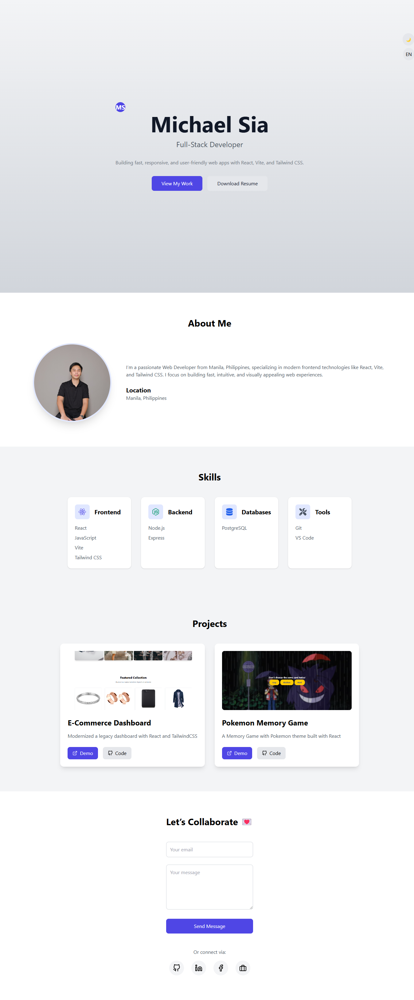

# Michael Sia - Portfolio 👨💻

[](https://www.npmjs.com/)
[](https://reactjs.org/)
[](https://opensource.org/licenses/MIT)

A modern developer portfolio showcasing projects, skills, and experience. Built with React + Vite and styled with Tailwind CSS.




## 🚀 Live Demo
**https://myportfolio-michael-sia.vercel.app/**

## ✨ Features
- 🌓 Dark/Light Mode Toggle
- 📱 Fully Responsive Design
- 🎯 Project Showcase with Case Studies
- 💻 Skills Section with Technology Icons
- 📧 Functional Contact Form (Formspree)
- 📈 Google Analytics Integration
- 🌐 Multi-language Support (English/Spanish)

## 🛠️ Technologies Used


| Frontend          | Backend          | Tools            |
|-------------------|------------------|------------------|
| React             | Node.js          | Git              |
| Vite              | Express          | VS Code          |
| Tailwind CSS      | Sanity CMS       | Figma            |
| Framer Motion     | MongoDB          | Postman          |

## 📦 Installation
1. Clone the repository
```bash
git clone https://github.com/yourusername/portfolio.git
cd portfolio
Install dependencies

bash
Copy
npm install
Start development server

bash
Copy
npm run dev
Build for production

bash
Copy
npm run build
🔧 Configuration
Formspree Contact Form

Create a form at Formspree

Add your form ID in Contact.jsx

Sanity CMS (Optional)

bash
Copy
npm install -g @sanity/cli
sanity init
Configure your schema in sanity/schema.js

Environment Variables

env
Copy
VITE_GA_TRACKING_ID=your-ga-id
VITE_SANITY_PROJECT_ID=your-sanity-id
🚀 Deployment
Deployed on Vercel - Deployment Guide

Deploy with Vercel

📁 Project Structure
bash
Copy
src/
├── components  # React components
├── data        # JSON data files
├── assets      # Images & styles
├── utils       # Helper functions
└── App.jsx     # Main component
🤝 Contributing
This is a personal portfolio, but feel free to fork and adapt for your own use!

📄 License
MIT © Michael Sia - See LICENSE for details

Made with ❤️ by Michael Sia | LinkedIn

Copy

---

### Key Sections to Customize:
1. **Demo Links**  
   Replace `your-portfolio.vercel.app` with your actual URL

2. **Social Media Links**  
   Update GitHub, LinkedIn, and other profile URLs

3. **Project Screenshot**  
   Add a screenshot in `/public/images/screenshot.png`

4. **Technologies Used**  
   Update the skill icons to match your actual tech stack using [skill-icons.dev](https://skillicons.dev)

5. **Analytics/CMS**  
   Remove Sanity CMS section if not used

---

### Bonus Tips:
1. Add a **"Project Showcase" GIF** in the Features section
2. Include **testimonials** if you have them
3. Add **performance metrics** (Lighthouse scores)
4. Include **dark mode screenshot** comparison

Would you like me to help you create any specific section in more detail? 😊